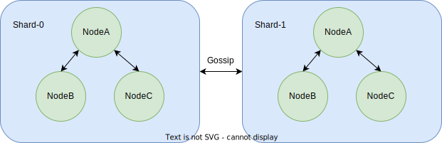

# Jet stream

## Summary

Jet is a distributed streaming system written in golang. The goal of this project is to make a kafka alternative that's
cloud native and easier to host, scale and maintain. Performance also need to be on par or faster(maybe)

## Design



### Nodes

Each node in this context represents a host or a pod. A node exists inside a shard, and can be either a leader or
follower.

### Shards

Each shard represents a group of nodes that are in the same raft group, in a raft group there's a single leader and
multiple followers. hashicorp/raft is used for the consensus in the group.
Each write operation goes to the leader node, and gets replicated to the followers; while a read operation goes to the
follower nodes.

### Discovery

The way each node knows the existence of others is through the gossip protocol. hashicorp/memberlist is used for this
purpose.

## Get Started

To build the repo use

```
go build
```

To run the binary jet do

```
./jet --raft_id "nodeA" --address "localhost:8080" --raft_data_dir "./testData" --data_dir "./testData/data" --gossip_address "localhost:8081" --shard_id "shardA"
```

There's also docker which you can build and run with the same arguments

```
docker run  -p 8080:8080 -p 8081:8081/tcp -p 8081:8081/udp jet:0.1 --raft_id "nodeA" --address localhost:8080 --raft_data_dir "./testData" --gossip_address "localhost:8081" --shard_id "shardA"
```

There also a helm chart available which you can run in kubernetes by doing

```
helm install jet ./intg
```

## What works

### Single node

On a single node, producing and consuming are both solid

### One raft group

One raft group is quite solid, still need resiliency improvements

### More than one raft group

Works well locally, but like the above lacks resiliency, for example currently there's only ack for consuming and
not publishing,which means if a publishing fails but other succeeds, the publishing will go through on the nodes that
did succeed.

## Contribution

To contribute, pick up an issue(when I make some), or just fix something you see, then just submit a pr and I'll review
it.